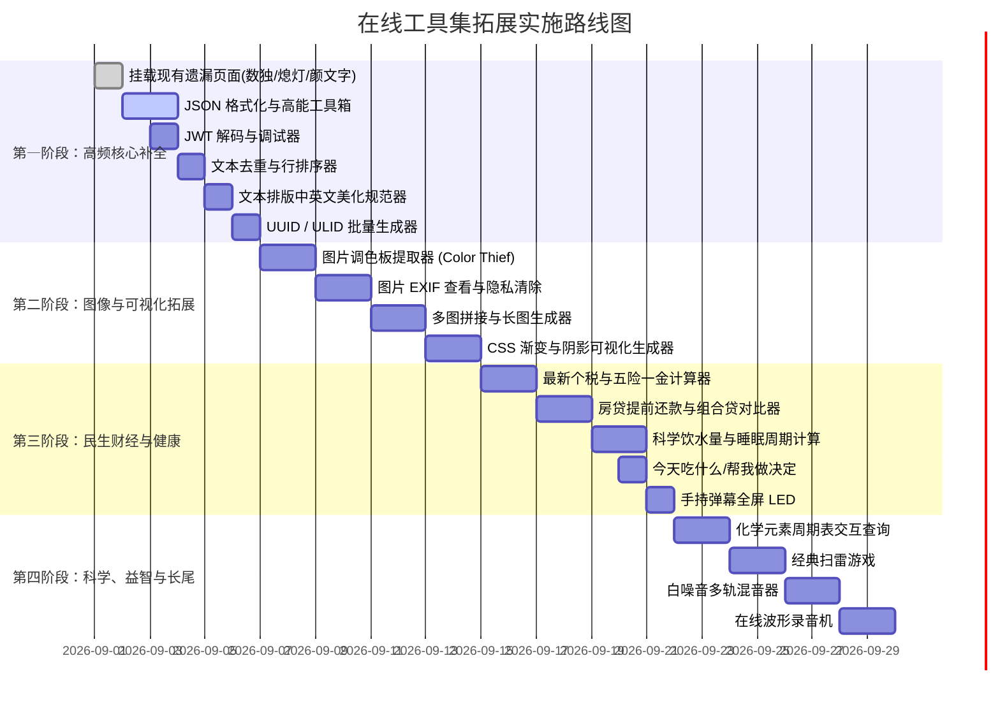

# 在线工具集 · 现有清单盘点与工具拓展规划 (TODO & Roadmap)

> 本文档针对当前部署源码中的现有功能资产进行全面盘点，并系统性规划后续可拓展的高价值离线工具库，按优先级与技术实现路径进行分级归类。

---

## 目录

1. [现有资产与全量清单盘点](#一现有资产与全量清单盘点)
2. [现有技术底座与可用库分析](#二现有技术底座与可用库分析)
3. [工具拓展原则与设计规范](#三工具拓展原则与设计规范)
4. [全分类 TODO 拓展清单 (P0 / P1 / P2)](#四全分类-todo-拓展清单)
   - [4.1 程序员工具 (Code & Dev)](#41-程序员工具-code--dev)
   - [4.2 办公助手 (Office & Text)](#42-办公助手-office--text)
   - [4.3 图像处理 (Image & Graphics)](#43-图像处理-image--graphics)
   - [4.4 音视频与多媒体 (Audio & Video)](#44-音视频与多媒体-audio--video)
   - [4.5 生成工具 (Generators)](#45-生成工具-generators)
   - [4.6 生活实用 (Life & Financial)](#46-生活实用-life--financial)
   - [4.7 学习与科学 (Study & Math)](#47-学习与科学-study--math)
   - [4.8 健康管理 (Health & Wellness)](#48-健康管理-health--wellness)
   - [4.9 脑力训练与益智 (Brain & Logic Games)](#49-脑力训练与益智-brain--logic-games)
   - [4.10 娱乐趣味 (Entertainment & Fun)](#410-娱乐趣味-entertainment--fun)
   - [4.11 建议新增分类：网络与运维 / 前端与设计](#411-建议新增分类网络与运维--前端与设计)
5. [分阶段实施路线图 (Roadmap)](#五分阶段实施路线图-roadmap)
6. [新工具标准化接入指南与开发模版](#六新工具标准化接入指南与开发模版)

---

## 一、现有资产与全量清单盘点

当前系统包含 **10 大常规分类**，主页导航及分类页共收录 **133 款** 在线工具与应用入口，另有 **4 款** 独立实现但未在主页注册的页面，以及 5 个系统级路由页面。

### 1.1 现有 10 大分类清单一览

| 序号 | 分类名称 | 路由 Key | 现有数量 | 分类定位与现有工具概要 |
|:---|:---|:---|:---:|:---|
| 01 | **脑力训练** | `brain` | 21+2 | 涵盖记忆力（4）、注意力（5）、推演（3）、反应（5）、感知（3）、空间（1）。另有数独与熄灯游戏独立页面。 |
| 02 | **办公助手** | `office` | 15+1 | 简历生成、纸张尺寸查询、大小写转换、Unicode装饰文本样式、文本替换、符号/Emoji大全。另有颜文字独立页面。 |
| 03 | **图像** | `image` | 15 | 格式转换、压缩、缩放、宽高比、水印、旋转、ICO、圆角、GIF制作/分解、视频转GIF、裁剪、九宫格等。 |
| 04 | **音视频** | `audio-and-video` | 8 | 视频/音频处理助手、剪切合并、压缩、格式转换（当前为桌面客户端介绍页）。 |
| 05 | **生成** | `generate` | 5 | 条形码生成器、二维码生成器、序列号生成器、随机数生成器、随机密码生成器。 |
| 06 | **程序员** | `code` | 22 | 端口扫描、JS混淆、Markdown编辑、时间戳转换、进制转换、各类哈希与对称加密、Base64/URL/Unicode编解码、代码对比、HTML/CSS/JS格式化压缩。 |
| 07 | **学习** | `study` | 11 | 长度/面积/体积/重量/温度单位换算、比例计算、周长/面积/表面积/体积计算、圆周率查询。 |
| 08 | **生活** | `life` | 13 | 年龄计算、退休年龄查询、各国首都/国旗、贷款计算器、各类男女及儿童服装/内衣/鞋帽尺码对照。 |
| 09 | **娱乐** | `ent` | 8 | 摩斯密码翻译、幸运大转盘、抽奖工具、身价计算、死亡时间、幸运数字/颜色、哈希头像生成。 |
| 10 | **健康** | `health` | 15 | BMI、基础代谢(BMR)、体脂率(BFR)、标准体重、燃脂心率、体质测试、蛋白质摄入、卡路里换算/跑步消耗、身材计算、安全期、身高预测、血型遗传、色盲检测、植物油脂肪。 |

### 1.2 现有具体工具清单汇总表

#### 01. 脑力训练 (`/brain`) - 21 款
- **记忆力 (4)**: 数字顺序记忆训练 (`/number-sequence-memory`)、顺序记忆训练 (`/sequence-memory`)、N-Back 记忆力训练游戏 (`/n-back`)、色块印记 (`/color-block-imprint`)
- **注意力 (5)**: 舒尔特方格训练 (`/shult-grid`)、找不同的字 (`/find-different-word`)、斯特鲁普效应 (`/stroop-effect`)、坐标迷航 (`/coordinate-drift`)、视觉追踪训练 (`/visual-tracking-training`)
- **推演 (3)**: 数字华容道 (`/digital-huarong-road`)、上下瓶色匹配 (`/bottle-color-matching`)、2048 (`/2048`)
- **反应 (5)**: 反应速度测试 (`/react-speed-test`)、点击速度测试 (`/click-speed-test`)、右键点击速度测试 (`/right-click-test`)、空格键计数器 (`/spacebar-counter`)、动态视力测试 (`/dynamic-visual-acuity-test`)
- **感知 (3)**: 静态色差感知 (`/jing-tai-se-cha`)、动态色差感知 (`/dong-tai-se-cha`)、时间感知训练 (`/time-perception-training`)
- **空间 (1)**: 对称方块 (`/symmetry-blocks`)
- *已存在未挂载页面*: 数独 (`/sudoku`)、熄灯游戏 (`/lights-out`)

#### 02. 办公助手 (`/office`) - 15 款
- 简历生成器 (`/resume-maker`)
- A4纸张尺寸，各种纸张尺寸查询 (`/paper-size`)
- 转换大小写 (`/convert-case`)
- 标题大小写转换器 (`/title-case-converter`)
- 句子大小写转换器 (`/sentence-case-converter`)
- 粗体文本生成器 (`/bold-text-generator`)
- 斜体文本生成器 (`/italic-text-generator`)
- 删除线文本生成器 (`/strikethrough-text-generator`)
- 下划线文本生成器 (`/underline-text`)
- 颠倒文本生成器 (`/upside-down-text-generator`)
- 镜像文本生成器 (`/mirror-text-generator`)
- 反向文本生成器 (`/reverse-text-generator`)
- 文本替换工具 (`/replace-text`)
- 符号大全 (`/symbols`)
- emoji表情大全 (`/emoji`)
- *已存在未挂载页面*: 颜文字表情大全 (`/emoticon`)、简历模板中心 (`/resume-template`)

#### 03. 图像处理 (`/image`) - 15 款
- 图像格式转换器 (`/convert-image`)
- 压缩图像 (`/compress-image`)
- 调整图像大小 (`/resize-image`)
- 调整图像宽高比例 (`/adjust-image-aspect-ratio`)
- 批量给图片加水印 (`/watermark-image`)
- 批量旋转图像 (`/rotate-image`)
- 在线生成透明ICO图标 (`/ico-generator`)
- 在线生成透明圆角图片 (`/round-image`)
- 制作gif图片，编辑gif图片 (`/create-gif`)
- 视频转gif图片，视频转动图 (`/video-to-gif`)
- 分解gif图片 (`/decompose-gif`)
- 裁剪、编辑图像 (`/crop-image`)
- 生成宫格图像，分割图片 (`/generate-grid-image`)
- 图像处理助手桌面应用程序 (`/image-processing-assistant-app`)
- 图像压缩器桌面应用程序 (`/image-compressor-app`)

#### 04. 音视频 (`/audio-and-video`) - 8 款
- 视频处理助手桌面应用程序 (`/video-processing-assistant-app`)
- 视频剪切合并桌面应用程序 (`/video-cut-merge-app`)
- 视频压缩器桌面应用程序 (`/video-compressor-app`)
- 视频格式转换器桌面应用程序 (`/video-format-converter-app`)
- 音频处理助手桌面应用程序 (`/audio-processing-assistant-app`)
- 音频剪切合并桌面应用程序 (`/audio-cut-merge-app`)
- 音频压缩器桌面应用程序 (`/audio-compressor-app`)
- 音频格式转换器桌面应用程序 (`/audio-format-convertor-app`)

#### 05. 生成工具 (`/generate`) - 5 款
- 条形码生成器 (`/bar-code`)
- 二维码生成器 (`/qrcode`)
- 序列号生成器 (`/serial-number`)
- 随机数生成器 (`/random-number`)
- 在线随机密码生成器 (`/random-password`)

#### 06. 程序员工具 (`/code`) - 22 款
- 端口扫描 (`/port-scan`)
- JavaScript混淆加密 (`/js-obfuscator`)
- Markdown在线编辑器，Markdown转Word/Html/Pdf (`/markdown`)
- 时间戳转换 (`/timestamp`)
- 进制转换 (`/base-converter`)
- MD5加密 (`/md5-encrypt`)
- AES加密/解密 (`/aes-encrypt`)
- DES加密/解密 (`/des-encrypt`)
- SHA加密 (`/sha-encrypt`)
- RIPEMD160哈希加密 (`/ripemd160-encrypt`)
- HMAC哈希加密 (`/hmac-encrypt`)
- Rabbit加密/解密 (`/rabbit-encrypt`)
- RC4加密/解密 (`/rc4-encrypt`)
- 图片转base64 (`/image-to-base64`)
- base64编码解码 (`/base64-encoder-decoder`)
- URL编码解码 (`/url-encoder-decoder`)
- 文本与ASCLL转换器 (`/text-to-ascll-converter`)
- Unicode编码器/解码器 (`/unicode-encoder-decoder`)
- 文本（代码）对比工具 (`/compare-text`)
- html格式化、压缩 (`/format-html`)
- css格式化、压缩 (`/format-css`)
- js格式化、压缩 (`/format-js`)

#### 07. 学习工具 (`/study`) - 11 款
- 长度单位转换器 (`/length-converter`)
- 面积单位转换器 (`/area-converter`)
- 体积单位转换器 (`/volume-converter`)
- 重量转换器 (`/weight-converter`)
- 温度转换器 (`/temperature-converter`)
- 比例计算器 (`/proportion-calculator`)
- 周长计算器 (`/perimeter-calculator`)
- 面积计算器 (`/area-calculator`)
- 表面积计算器 (`/surface-area-calculator`)
- 体积计算器 (`/volume-calculator`)
- 圆周率查询 (`/pi-query`)

#### 08. 生活实用 (`/life`) - 13 款
- 年龄计算器 (`/age`)
- 退休年龄查询 (`/retirement-time-query`)
- 世界各国首都 (`/capital`)
- 世界各国国旗和区旗图案 (`/flag`)
- 贷款计算器 (`/loan-calculator`)
- 文胸尺码查询 (`/bra-size`)
- 内裤尺码查询 (`/underwear-size`)
- 女装尺码查询 (`/woman-clothing-size`)
- 女士衬衫尺码查询 (`/woman-shirt-size`)
- 连衣裙尺码查询 (`/dress-size`)
- 小孩服装尺码查询 (`/child-clothe-size`)
- 男士服装尺码查询 (`/man-clothing-size`)
- 男士裤子尺码查询 (`/man-pant-size`)

#### 09. 娱乐趣味 (`/ent`) - 8 款
- 摩斯密码翻译器，摩斯密码音频播放器 (`/morse-code-translator`)
- 幸运大转盘抽奖 (`/lucky-wheel`)
- 在线抽奖工具 (`/lottery`)
- 身价计算器 (`/worth`)
- 死亡时间计算器 (`/death-time`)
- 幸运数字计算器 (`/lucky-number`)
- 星座幸运色 (`/lucky-color`)
- 哈希头像生成器 (`/hash-avatar`)

#### 10. 健康管理 (`/health`) - 15 款
- BMI指数计算 (`/bmi`)
- 基础代谢率(BMR)计算器 (`/bmr`)
- 体脂率（BFR）计算器 (`/bfr`)
- 标准体重计算器 (`/weight`)
- 燃脂心率计算器 (`/burn-fat-heart-rate`)
- 体质综合测试 (`/physical-fitness-test`)
- 蛋白质摄入量计算器 (`/protein-intake`)
- 焦耳卡路里换算器 (`/energy-convert`)
- 跑步卡路里消耗计算器 (`/running-calorie`)
- 女性最佳身材计算器 (`/best-figure`)
- 女性安全期计算器 (`/female-safe-period`)
- 孩子身高预测 (`/child-height`)
- 血型遗传规律和血型性格 (`/bood-type`)
- 色盲色弱检测 (`/color-blindness-test`)
- 植物油脂肪含量查询 (`/vegetable-oil`)

---

## 二、现有技术底座与可用库分析

本项目为**全离线、纯前端为主 + 轻量 Node.js 辅助**架构。本地 `lib/` 目录下已预置了大量高价值第三方基础库，可直接复用于新工具开发：

| 库名称 / 目录 | 主要能力 | 适用拓展工具场景 |
|:---|:---|:---|
| `monaco-editor` | 微软 Monaco 代码编辑器（语法高亮、自动补全、折叠） | JSON 工具箱、SQL 美化、YAML/TOML 编辑、代码 Playground |
| `color-thief` | 从图片中自动提取主色调与色彩调色板 | 图片调色板生成、主题色提取器、配色助手 |
| `ImageMagick` (WASM) | 浏览器端 WebAssembly 图像高级处理能力 | 高级图像格式转换、批量滤镜、图像特效 |
| `cropper` | 图片交互式裁剪与旋转缩放 | 证件照裁剪、头像制作器 |
| `fabric` | Canvas 复杂绘图对象引擎 | 签名生成器、图片涂鸦打码、海报合成器 |
| `jszip` | 客户端文件压缩与解压（ZIP） | 多图打包下载、批量文件处理、代码包打包 |
| `html2canvas` | DOM 节点无感截屏渲染为图片 | 文本海报生成、长截图导出、证书/奖状生成 |
| `html-docx` | HTML 快速导出为 Word (`.docx`) 文档 | 简历导出、Markdown 导出 Word、富文本报告生成 |
| `cryp` (CryptoJS) | MD5, SHA, AES, DES, HMAC, RC4, Rabbit 等加解密 | 扩展 JWT 校验、密码学工具箱、文件 Hash 计算 |
| `js-beautify` | JS, CSS, HTML 格式化与美化 | 扩展前端代码美化器与压缩器 |
| `moment` | 时间与日期解析、推算、格式化 | 倒计时、节假日推算、日期间隔、生理周期精算 |
| `lucky-canvas` | 大转盘、九宫格抽奖 Canvas 引擎 | 趣味决定器、转盘抽取器 |
| `gifshot` / `libgif` | GIF 编码、解码、帧拆分与动图制作 | 表情包制作、GIF 加水印与压缩 |
| `JsBarcode` / `qrcode` | 条形码与二维码绘制 | WiFi 二维码、名片二维码生成器 |

---

## 三、工具拓展原则与设计规范

1. **纯前端与离线优先 (Local & Offline First)**：所有新增工具优先使用纯 JS、Canvas、Web API、WebAssembly 或离线内置 JSON 数据集完成，零外部网络 API 依赖。
2. **免登录即用 (Zero Friction)**：无需强制登录即可体验全部核心功能，个人历史记录保存在浏览器 `localStorage` 或本地 SQLite/Store 中。
3. **视觉与交互统一 (Design Consistency)**：
   - 沿用 Tailwind + 深色终端风格（Dark Terminal UI）。
   - 顶部导航栏保留 `tool-topbar`，包含面包屑返回首页链接。
   - 输入输出区域提供一键“复制 (Copy)”、“清空 (Clear)”、“示例 (Sample)”以及“下载 (Download)”等便捷操作。
4. **Clean-URL 自动路由**：页面直接放置在 `pages/<toolCode>.html`，`server.js` 会自动匹配并映射，无需配置繁琐路由表。

---

## 四、全分类 TODO 拓展清单

按实现价值与紧迫度划分为：
- **P0（核心高频，必加）**：大众最常用、开发者与办公刚需、立竿见影。
- **P1（高价值实用，推荐）**：功能丰富、体验极佳、能显著提升工具箱专业度。
- **P2（长尾趣味，完善）**：趣味性强、垂直细分、锦上添花。

---

### 4.1 程序员工具 (Code & Dev)

> **现状评价**：已有基础加密和简单格式化，但严重缺少现代开发者日常使用频率最高的 **JSON 深度处理、JWT、Regex、Cron、SQL 美化** 等核心工具。

| 优先级 | 工具名称 | 建议路由 (`toolCode`) | 核心功能与技术方案 |
|:---:|:---|:---|:---|
| **P0** | **JSON 格式化与高能工具箱** | `/json-formatter` | ✅ **已实现 (2026-08-31)**：JSON 格式化/压缩/排序/去转义、交互树状视图折叠、路径检索 (JSONPath)、错误行号精准定位与一键自愈修复、转 TypeScript 接口 / Go Struct / JSON Schema。 |
| **P0** | **JWT 解码与调试器** | `/jwt-debugger` | ✅ **已实现 (2026-08-31)**：粘贴 JWT 自动解构 Header / Payload / Signature 三色拆解、HMAC-SHA256 签名实时验证与生成、Claims 智能诊断 (exp/iat/nbf 状态与倒计时)、JWT 在线快速构建签发。 |
| **P0** | **正则表达式测试与速查器** | `/regex-tester` | ✅ **已实现 (2026-08-31)**：实时正则匹配测试、捕获组高亮显示、正则常用修饰符切换、常用正则模板库（手机号、邮箱、IP、身份证、URL 等）、替换预览。 |
| **P0** | **Cron 表达式生成与执行预测** | `/cron-generator` | ✅ **已实现 (2026-08-31)**：可视化选择“秒、分、时、日、月、周、年”生成 5/6/7 段 Cron 表达式，反向解析 Cron 语法，并计算预测未来 10 次的触发时间点。 |
| **P1** | **SQL 格式化与美化器** | `/sql-formatter` | 支持 MySQL, PostgreSQL, Oracle, SQLite 等方言的 SQL 语句美化、关键字大写、缩进排版与压缩。 |
| **P1** | **cURL 转换代码工具** | `/curl-converter` | 将 cURL 请求命令自动解析转换为 JavaScript (Fetch / Axios), Python (Requests), Go (net/http), PHP, Java 等多语言代码。 |
| **P1** | **XML / YAML / JSON / TOML 互转** | `/data-format-converter` | 开发者常见配置文件格式双向互相转换与校验。 |
| **P1** | **HTTP 状态码速查与错误排查手册** | `/http-status-codes` | 1xx ~ 5xx 全量 HTTP 状态码的官方语义、常见出现场景、排错建议及中英文说明。 |
| **P2** | **Linux / Docker 常用命令速查卡** | `/devops-cheatsheet` | 交互式分类检索 Linux 常用系统运维、文件处理、网络诊断命令及 Docker 常用操作。 |
| **P2** | **IP 子网掩码与 CIDR 计算器** | `/subnet-calculator` | 输入 IP 与子网掩码（如 `192.168.1.0/24`），计算网络地址、广播地址、可用 IP 范围、子网主机数与二进制掩码。 |

---

### 4.2 办公助手 (Office & Text)

> **现状评价**：已有大小写与简单字符转换，但缺少**文本排版清洗、去重统计、表格转换、大写金额**等日常文字与财务办公必备工具。

| 优先级 | 工具名称 | 建议路由 (`toolCode`) | 核心功能与技术方案 |
|:---:|:---|:---|:---|
| **P0** | **文本去重与多维行排序器** (已实现) | `/text-dedup-sort` | 大文本多行去重、保留唯一行、去除空白行、按拼音/字母升序/降序、按字符长度排序、提取重复行/差异行、行号统计与节省比率计算。 |
| **P0** | **中英文排版规范美化器** (已实现) | `/text-autospace` | 依据《中文文案排版指北》，自动在中英文、中文与数字之间添加标准半角空格，统一全角/半角标点，修复乱用引号，保护 Markdown 语法。 |
| **P0** | **在线表格转换器** (已实现) | `/table-converter` | 支持 Excel / CSV / TSV 粘贴与文件导入，一键转换为 Markdown 表格、HTML 表格、JSON 数组/对象、ASCII 纯文本表格、CSV 导出及 SQL 批量插入，支持列隐藏/别名/对齐与实时表格预览。 |
| **P0** | **人民币/金额大写转换器** (已实现) | `/rmb-capital-converter` | 财务专用：数字金额转标准中文大写（支持大额高精度、正负数、小数角分厘毫、零元规范），支持中文大写反向转数字与一致性校验，内置银行支票分格展示与人民银行防篡改指南。 |
| **P1** | **文本综合字数与阅读时长统计** (已实现) | `/word-counter` | 实时统计总字符、汉字数、英文词数、数字、标点、空白符、段落与行数，提供朗读、默读、速读及自定义 WPM 阅读时长估算，内置高频词频 Top 10 与排版密度指标。 |
| **P1** | **汉字转拼音与注音工具** | `/pinyin-converter` | 汉字转带声调拼音、无声调拼音、首字母大写缩写、多音字标注，方便文字处理与排版。 |
| **P1** | **纯前端 PDF 实用工具箱** | `/pdf-tools` | 基于 `pdf-lib` / `pdf.js`，纯浏览器本地实现 PDF 多文件合并、单文件页面拆分提取、PDF 页面转高清图片。 |
| **P2** | **常用公文排版标准与字号查询** | `/official-document-spec` | 国家公文格式规范速查：初号到八号字磅数/毫米对照、标题与正文字体选用、行间距与版心页边距规范。 |

---

### 4.3 图像处理 (Image & Graphics)

> **现状评价**：已有基础裁剪/压缩/转图，结合已有的 `color-thief`、`cropper` 和 `ImageMagick WASM`，可拓展更实用的**调色板提取、EXIF元数据擦除、图片拼接、纯色抠图**。

| 优先级 | 工具名称 | 建议路由 (`toolCode`) | 核心功能与技术方案 |
|:---:|:---|:---|:---|
| **P0** | **图片调色板提取器 (Color Palette)** | `/color-palette-extractor` | 上传图片，利用内置 `color-thief` 自动提取图片主色调与前 10 个主导色彩，提供 HEX / RGB / HSL 色值复制与调色板卡片导出。 |
| **P0** | **图片 EXIF 元数据查看与一键清除** | `/image-exif-cleaner` | 纯前端读取图片拍摄相机、镜头型号、曝光参数、拍摄时间及 GPS 经纬度地图定位，支持一键无损剥离 EXIF 元数据保护隐私。 |
| **P0** | **多图拼接与长图生成器** | `/image-stitcher` | 支持多张图片横向拼图、纵向长图拼接、九宫格拼图，支持自定义内边距、外边距、圆角与背景颜色。 |
| **P1** | **纯前端图片马赛克与隐私遮挡** | `/image-mosaic-blur` | Canvas 交互式涂抹：支持局部马赛克、高斯模糊、红框标注重心、黑块遮挡敏感信息（密码、姓名、身份证）。 |
| **P1** | **SVG 压缩与代码优化器** | `/svg-optimizer` | 移除 SVG 多余标签、元数据、XML 命名空间，精简浮点坐标，实时对比文件体积缩减比率，支持即时代码与预览。 |
| **P1** | **纯色背景抠图 / 证件照换底色** | `/background-remover` | 针对白底/蓝底/红底等纯色背景证件照，基于 Canvas 颜色容差与边缘羽化算法快速替换为目标背景色（红/蓝/白/灰）。 |
| **P2** | **CSS 精灵图 (Sprites) 合成器** | `/css-sprite-generator` | 批量上传小图标，自动排版打包为单张雪碧图，并输出对应的 CSS class 坐标偏移代码。 |

---

### 4.4 音视频与多媒体 (Audio & Video)

> **现状评价**：目前音视频页面均为桌面客户端引流卡片，缺少真正的**纯浏览器端 Web Audio / MediaStream 工具**。

| 优先级 | 工具名称 | 建议路由 (`toolCode`) | 核心功能与技术方案 |
|:---:|:---|:---|:---|
| **P0** | **白噪音与专注助眠混音器** | `/white-noise-player` | 纯前端合成雨声、海浪、雷鸣、森林鸟鸣、咖啡馆、篝火、粉红噪音等音轨，支持多轨音量独立调节与定时关闭。 |
| **P0** | **在线波形录音机** | `/voice-recorder` | 利用浏览器的 `navigator.mediaDevices.getUserMedia` 实现麦克风录音，实时绘制音频动态波形，支持导出为 WAV / MP3。 |
| **P1** | **免插件屏幕录制工具** | `/screen-recorder` | 基于 `getDisplayMedia` 纯浏览器录制屏幕/特定窗口/浏览器标签页，可选录制系统声音与麦克风，录制完成一键下载 WebM / MP4。 |
| **P1** | **在线音频剪切器 (Web Audio)** | `/audio-cutter-online` | 基于 Web Audio API 解码音频文件，可视化拖拽选择起止时间点，即时试听并导出裁剪后的音频。 |
| **P2** | **电子节拍器与乐器调音器** | `/metronome-tuner` | 音乐人工具：高精度 Web Audio 节拍器（支持 30~280 BPM、多种节拍节奏型）与麦克风基准音高频率检测。 |

---

### 4.5 生成工具 (Generators)

> **现状评价**：已有条形码、二维码与简单密码，需扩充**开发与设计常用的唯一标识符、测试假数据、CSS 特效生成**。

| 优先级 | 工具名称 | 建议路由 (`toolCode`) | 核心功能与技术方案 |
|:---:|:---|:---|:---|
| **P0** | **UUID / ULID / NanoID 批量生成器** | `/uuid-generator` | 支持批量生成 v4 UUID (大/小写/连字符/无连字符)、NanoID、时间有序的 ULID，支持复制与文本导出。 |
| **P0** | **CSS 渐变色生成器 (Gradient Studio)** | `/css-gradient-generator` | 线性渐变 (Linear)、径向渐变 (Radial)、圆锥渐变 (Conic) 的可视化调色盘，预置数十款高品质渐变方案，一键复制 CSS。 |
| **P0** | **CSS 阴影与发光生成器 (Box Shadow)** | `/css-shadow-generator` | 交互式滑动条调节水平/垂直偏移、模糊半径、扩散半径、阴影颜色与内阴影 (inset)，实时预览并生成 CSS 代码。 |
| **P1** | **测试模拟假数据生成器 (Mock Data)** | `/mock-data-generator` | 批量生成姓名、手机号、二代身份证号校验位符合规则的假数据、中国地址、邮箱、银行卡号、公司名（用于软件测试）。 |
| **P1** | **占位图生成器 (Placeholder Image)** | `/placeholder-generator` | 可视化生成各种尺寸（如 `800x600`）的占位图片，自定义文字、背景色、文字颜色，支持 Canvas 导出 PNG/SVG。 |
| **P2** | **ASCII 艺术字与字符画生成器** | `/ascii-art-generator` | 输入英文字符，通过内置 Figlet 字体库实时生成炫酷的终端 ASCII 字符艺术字。 |

---

### 4.6 生活实用 (Life & Financial)

> **现状评价**：已有年龄和尺码，需重点补全**中国本土高频计算：个税社保、提前还贷省息、复利定投、纪念日倒计时、亲戚关系**。

| 优先级 | 工具名称 | 建议路由 (`toolCode`) | 核心功能与技术方案 |
|:---:|:---|:---|:---|
| **P0** | **最新个税与五险一金计算器** | `/salary-tax-calculator` | 支持输入税前薪资、公积金比例、各项专项附加扣除，按中国现行个人所得税累进税率表精准计算税后到手与个人/企业缴纳明细。 |
| **P0** | **房贷提前还款与组合贷对比器** | `/mortgage-advanced-calculator`| 在现有房贷计算基础上，支持“部分提前还款”、“缩短还款期限 vs 减少月供”的节省利息精确测算，以及公积金+商贷组合贷款对比。 |
| **P0** | **日期间隔与重要日子倒计时** | `/date-calculator` | 计算两个指定日期之间的相隔天数/周数/月数，推算某日期前/后 N 天的具体日期，重要纪念日/高考/考研/节假日倒计时。 |
| **P1** | **复利定投与理财收益计算器** | `/compound-interest-calculator`| 输入初始本金、每月定投金额、年化收益率与投资年限，动态渲染复利收益走势图表与本金/利息占比。 |
| **P1** | **中国亲戚关系称谓换算器** | `/kinship-calculator` | 逢年过节必备：输入关系链（如“爸爸的哥哥的儿子的女儿”），自动推导出正确的亲戚称谓（“堂侄女”）。 |
| **P1** | **车贷月供与购车落地费用计算器** | `/car-loan-calculator` | 购车全费用测算：裸车价、车辆购置税、交强险、商业险、上牌费与车贷分期利息全周期明细。 |
| **P2** | **历史上的今天速查** | `/history-today` | 纯本地离线历史大事件数据库（按 366 天归类），查询今天在人类历史上发生的政治、科技、文化大事。 |
| **P2** | **生活垃圾分类速查** | `/garbage-classification` | 离线垃圾分类数据字典：输入物品名称快速匹配为可回收物、有害垃圾、湿垃圾(厨余)、干垃圾(其他)。 |

---

### 4.7 学习与科学 (Study & Math)

> **现状评价**：已有基础几何与常用单位，可拓展至**高级科学计算、函数绘图、元素周期表、进制位运算可视化**。

| 优先级 | 工具名称 | 建议路由 (`toolCode`) | 核心功能与技术方案 |
|:---:|:---|:---|:---|
| **P0** | **化学元素周期表交互查询系统** *(已完成)* | `/periodic-table` | 响应式交互式 118 个化学元素周期表，提供元素符号、原子量、电子排布、金属分类、发现历史及中文拼音发音。 |
| **P0** | **数据存储单位与进阶单位换算器** *(已完成)* | `/data-unit-converter` | 支持 Bit, Byte, KB, KiB, MB, MiB, GB, GiB, TB, PB 的 1000 与 1024 进制精准换算，以及压强、功率、速度换算。 |
| **P1** | **2D 数学函数图像绘制器** | `/function-grapher` | 基于 Canvas 实时解析数学表达式（如 `y = sin(x) + x^2`），支持坐标系缩放、拖拽平移、极值点观察。 |
| **P1** | **计算机位运算与逻辑门可视化** | `/bitwise-visualizer` | 8/16/32 位二进制位运算可视化（AND, OR, XOR, NOT, 左移 <<, 右移 >>, 原码/反码/补码动态切换）。 |
| **P2** | **科学高级计算器** *(已完成)* | `/scientific-calculator` | 支持三角函数（sin/cos/tan）、对数（log/ln）、指数、阶乘、开方、括号嵌套与计算历史记录。 |

---

### 4.8 健康管理 (Health & Wellness)

> **现状评价**：已有基础身体指标计算，可增加**饮水量、睡眠周期、视力/散光自测、食物热量速查**。

| 优先级 | 工具名称 | 建议路由 (`toolCode`) | 核心功能与技术方案 |
|:---:|:---|:---|:---|
| **P0** | **科学饮水量计算与喝水提醒** *(已完成)* | `/water-intake-calculator` | 根据体重、每日运动强度、环境气温与出汗情况，科学计算每日最佳饮水量，并生成8杯水分时段喝水时间表与打卡提醒。 |
| **P0** | **90分钟睡眠周期与起床时间计算器** *(已完成)* | `/sleep-cycle-calculator` | 根据人体 90 分钟快速眼动 (REM) 睡眠周期原理，计算在何时入睡或起床能避免在深度睡眠中被唤醒，保持精力充沛。 |
| **P1** | **视力表与散光/阿姆斯勒方格自测** | `/vision-test` | 纯前端标准 E 字视力测试、散光放射线自测图、黄斑变性阿姆斯勒方格自测（附标准使用距离指引）。 |
| **P1** | **常用食物热量与营养成分速查表** *(已完成)* | `/food-calories-lookup` | 纯本地食物营养成分字典：查询谷物、肉类、海鲜、蔬菜、水果、乳品的每 100g 热量、蛋白质、碳水、脂肪与 GI 升糖指数及组合计算。 |
| **P2** | **预产期与孕周发育计算器** | `/pregnancy-calculator` | 根据末次月经时间计算预产期、当前孕周、胎儿发育关键阶段及重要产检时间节点倒计时。 |

---

### 4.9 脑力训练与益智 (Brain & Logic Games)

> **现状评价**：已有 21 款游戏，数独与熄灯游戏已在源码中开发完成，需完成导航挂载，并进一步补充经典逻辑推演游戏。

| 优先级 | 工具名称 | 建议路由 (`toolCode`) | 核心功能与技术方案 |
|:---:|:---|:---|:---|
| **P0** | **挂载已有页面：数独 & 熄灯游戏** | `/sudoku` / `/lights-out` | 将已有的数独游戏和熄灯游戏在 `pages/index.html` 与 `pages/brain.html` 的 `toolData` 中正式注册展示。 |
| **P0** | **经典扫雷 (Minesweeper)** | `/minesweeper` | 经典 Windows 扫雷纯前端实现：支持初级 (9x9)、中级 (16x16)、高级 (30x16) 及自定义雷区，支持插旗标记、双击开雷、计时与排行榜。 |
| **P1** | **推箱子经典益智闯关 (Sokoban)** | `/sokoban` | 经典推箱子解谜游戏：预置 50+ 经典关卡，支持撤销步数、步数统计与关卡选择。 |
| **P1** | **汉诺塔逻辑演练 (Tower of Hanoi)** | `/tower-of-hanoi` | 经典递归益智游戏：支持 3~8 层盘子自选，记录最少移动步数与自动求解演示功能。 |
| **P2** | **记忆翻牌对对碰 (Memory Cards)** | `/memory-cards` | 翻牌记忆配对游戏：支持图形、Emoji、数字等多种主题，训练短期视觉记忆力。 |
| **P2** | **快速心算口算达人 (Mental Math)** | `/mental-math-challenge` | 限时加减乘除心算闯关，支持选择难度阶梯，记录答题准确率与反应速度。 |

---

### 4.10 娱乐趣味 (Entertainment & Fun)

| 优先级 | 工具名称 | 建议路由 (`toolCode`) | 核心功能与技术方案 |
|:---:|:---|:---|:---|
| **P0** | **今天吃什么 / 帮我做选择** | `/decision-maker` | 专治选择困难症：支持“今天吃什么”、“掷骰子”、“抛硬币”、“抽签”，支持用户自定义增删备选项目。 |
| **P0** | **手持弹幕 / 全屏滚动走字机 (LED Banner)** | `/led-banner` | 手机全屏滚动发光字、演唱会/接机/应援手持弹幕：支持调节字号、滚动速度、背景色、文字渐变发光特效。 |
| **P1** | **生日性格密码与生命灵数** | `/life-number-calculator` | 依据公历生日推导生命灵数与性格九宫格特质分析。 |
| **P2** | **印章生成器 / 字符印章** | `/stamp-generator` | 生成古典中式印章（阴刻/阳刻、篆体/宋体、圆形/方形），可一键导出透明 PNG。 |

---

### 4.11 建议新增分类：网络与运维 / 前端与设计

随着工具体系逐渐壮大，建议在现有 10 大分类基础上新增以下两类，使分类更加精准：

#### 新增分类 A：网络与运维 (`/network`)
- **DNS 解析记录查询与对比**
- **User-Agent 分析与设备识别**
- **Nginx 常用配置文件生成器**
- **WebSocket 在线测试与回环调试客户端**

#### 新增分类 B：前端与设计 (`/design`)
- **颜色代码转换器 (HEX / RGB / HSL / CMYK / LAB)**
- **无障碍色彩对比度检测器 (WCAG AA/AAA)**
- **CSS 异形圆角生成器 (Fancy Border Radius)**
- **CSS 玻璃拟态效果生成器 (Glassmorphism Generator)**

---

## 五、分阶段实施路线图 (Roadmap)



---

## 六、新工具标准化接入指南与开发模版

### 6.1 开发步骤三步法

1. **新建工具页面**：在 `pages/` 目录下创建 `[tool-name].html`（例如 `pages/json-formatter.html`）。
2. **注册路由与清单**：
   - 在 `pages/index.html` 的 `var toolData` 数组中添加对应的工具配置项。
   - 在对应分类导航页（如 `pages/code.html`）的 HTML 列表与 `toolData` 中同步添加。
3. **本地验证**：执行 `node server.js`，访问 `http://localhost:8093/[tool-name]` 验证 Clean-URL、深色主题适配、数据输入与输出行为。

### 6.2 标准工具页面 HTML 骨架模版

```html
<!DOCTYPE html>
<html lang="zh" class="dark">
<head>
    <meta charset="utf-8" />
    <meta name="viewport" content="width=device-width, initial-scale=1.0, maximum-scale=1.0, minimum-scale=1.0, user-scalable=no" />
    <title>工具标题 - 在线工具</title>
    <meta name="description" content="工具的一句话描述与主要功能说明。" />
    <meta name="keywords" content="关键词1, 关键词2, 在线工具" />
    
    <link rel="shortcut icon" type="image/x-icon" href="/favicon.ico" />
    <link href="./lib/element-plus/index.css" rel="stylesheet" />
    <link href="./css/6767-tailwind.css?v=20260813" rel="stylesheet" />
    <link href="./css/6767-site.css?v=20260813" rel="stylesheet" />
    <link href="./css/tool-dark.css?v=20260813" rel="stylesheet" />
</head>
<body>
<div class="grid-bg"></div>

<!-- 统一顶部导航 -->
<header class="tool-topbar">
  <a href="./" class="tool-topbar-logo" aria-label="首页">
    <span>在线工具集</span>
  </a>
  <span class="tool-topbar-sep">/</span>
  <span class="tool-topbar-title">工具名称</span>
  <a href="./" class="tool-topbar-home">&#8592; 首页</a>
</header>

<main class="main-body tool-page-body">
  <div class="tool-body">
    <div class="card-model">
      <div class="card-body">
        <div class="tool-head">
          <h1 class="title">工具名称</h1>
        </div>
        <div class="description">
          本工具提供某某核心功能，纯前端离线计算，保护数据隐私安全。
        </div>

        <!-- Vue 3 + Element Plus 表单/操作区域 -->
        <el-form :model="formData" class="tool-form" label-position="top">
          <el-form-item label="输入内容">
            <el-input v-model="formData.input" type="textarea" :rows="5" placeholder="请输入..." />
          </el-form-item>

          <el-form-item>
            <el-button type="primary" @click="handleProcess">立即处理</el-button>
            <el-button @click="handleClear">清空</el-button>
            <el-button @click="handleCopy">复制结果</el-button>
          </el-form-item>

          <el-form-item label="处理结果">
            <el-input v-model="formData.output" type="textarea" :rows="5" readonly />
          </el-form-item>
        </el-form>

      </div>
    </div>
  </div>
</main>

<script src="./lib/vue/vue.global.prod.js"></script>
<script src="./lib/element-plus/index.js"></script>
<script src="./js/common.js"></script>
<script>
  const { createApp, ref, reactive } = Vue;
  const app = createApp({
    setup() {
      const formData = reactive({
        input: '',
        output: ''
      });

      const handleProcess = () => {
        // 核心业务逻辑
        formData.output = formData.input.trim();
      };

      const handleClear = () => {
        formData.input = '';
        formData.output = '';
      };

      const handleCopy = () => {
        if (!formData.output) return;
        navigator.clipboard.writeText(formData.output).then(() => {
          ElementPlus.ElMessage.success('复制成功');
        });
      };

      return { formData, handleProcess, handleClear, handleCopy };
    }
  });
  app.use(ElementPlus);
  app.mount('.main-body');
</script>
</body>
</html>
```
